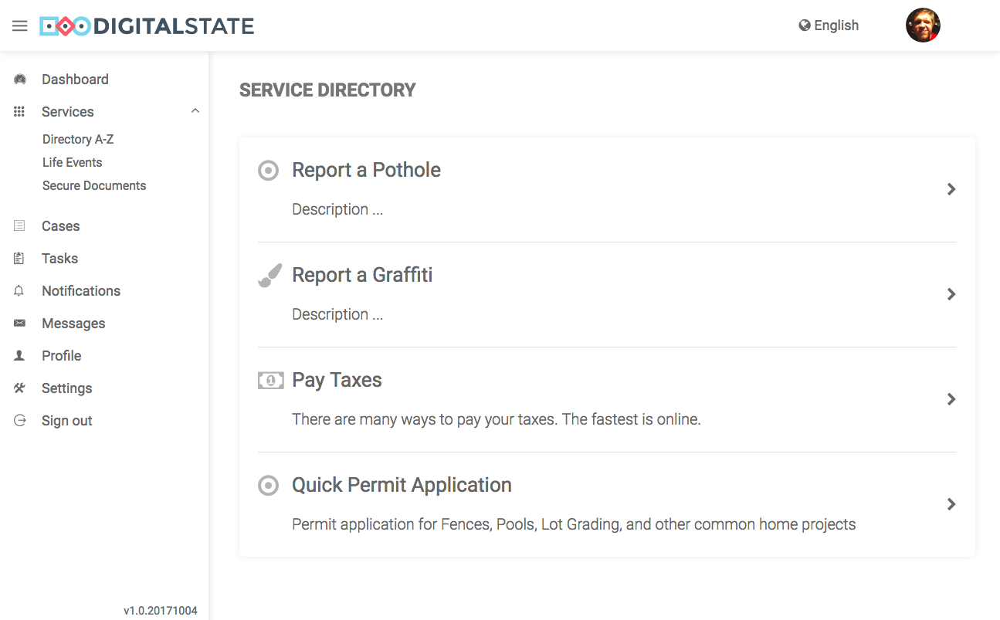
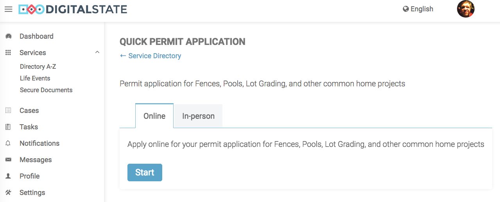
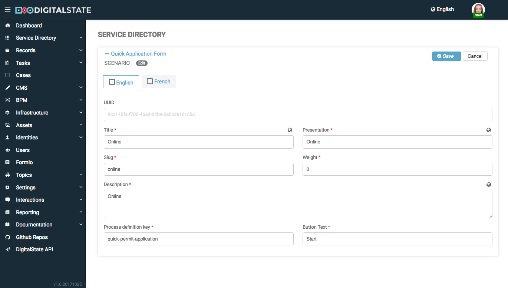
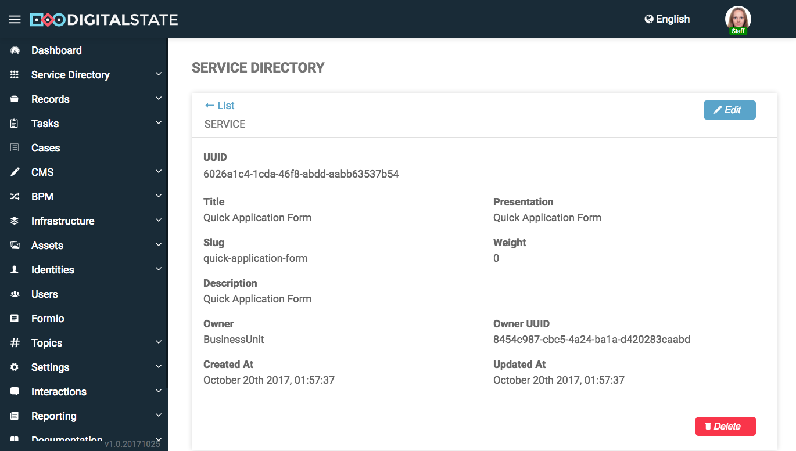
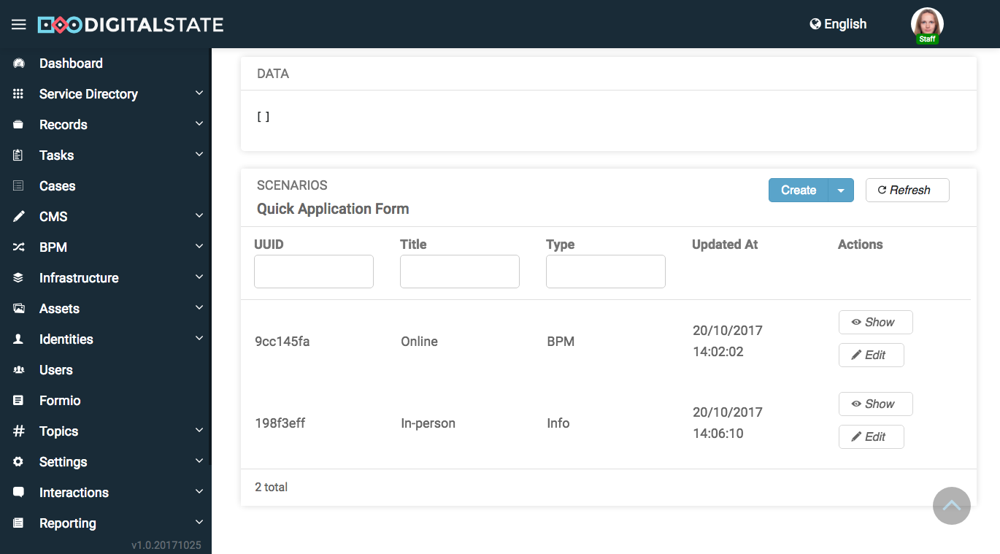
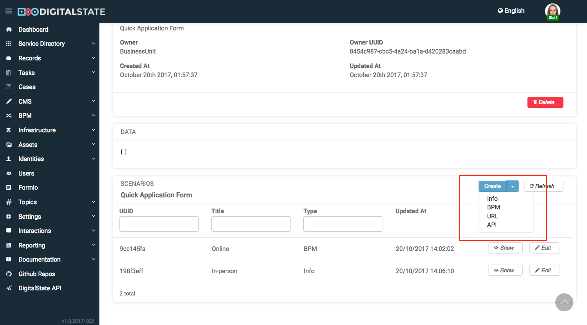
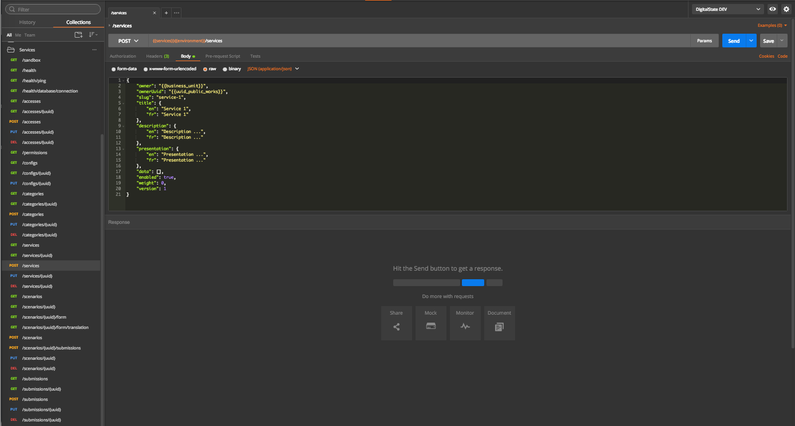

# Services

The Services microservice provides a robust Services engine to manage multiple Service related business functions:

1. Service Directory
1. Service Categorization
1. Multiple Service Scenario Types
1. Service Submissions
1. Service Form Schemas
1. Service Form Validations

The Services microservice connects with the Camunda and Formio microservices for BPM Scenario submissions.

## Screenshots

The following are screenshots of various aspects of the Services Microservice being rendered using the the Portal and Admin SPAs

---

---

---

---

---

---

## Table of Contents

- [Documentation](#documentation)
- [Contributing](#contributing)
- [Credits](#credits)

## Documentation

...

### Scenario Type: BPM

The `BPM` scenario type is a complex scenario type that generates data flows across multiple micro services.

See: [BPM Scenario Data Flow](./docs/bpm-scenario-data-flow.md) documentation for further information about how data is exchanged between Services, Formio, Camunda, and the Client.

## Contributing

Please read [CONTRIBUTING.md](CONTRIBUTING.md) for details on our code of conduct, and the process for submitting pull requests to us.

## Credits

This work has been developed by DigitalState.io
