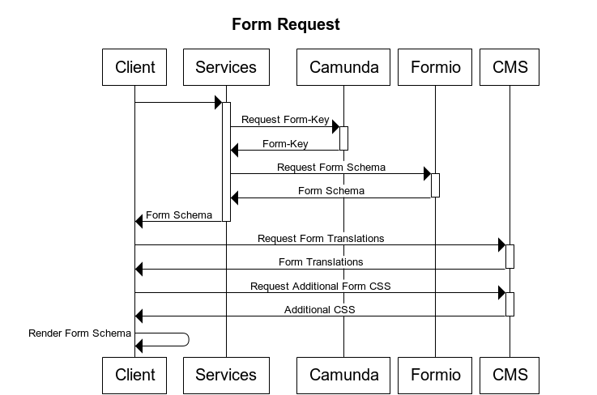
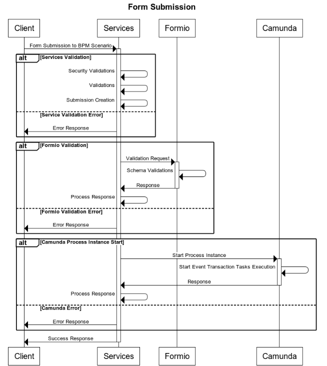

# Sequence Flow

## Form Schema Request



```
title Form Request

Client->+Services:
Services->+Camunda: Request Form-Key
Camunda->-Services: Form-Key
Services->+Formio: Request Form Schema
Formio->-Services: Form Schema
Services->-Client: Form Schema

Client->+CMS: Request Form Translations
CMS->-Client: Form Translations

Client->+CMS: Request Additional Form CSS
CMS->-Client: Additional CSS

Client->Client: Render Form Schema
```


## Form Submission



```
title Form Submission

Client->+Services: Form Submission to BPM Scenario

alt Services Validation
    Services->Services: Security Validations
    Services->Services: Validations
    Services->Services: Submission Creation
    
else Service Validation Error
    Services->Client: Error Response
end

alt Formio Validation
    Services->+Formio: Validation Request
    Formio->Formio: Schema Validations
    Formio->-Services: Response
    Services->Services: Process Response
else Formio Validation Error
    Services->Client: Error Response
end

alt Camunda Process Instance Start
    Services->+Camunda: Start Process Instance
    Camunda->Camunda: Start Event Transaction Tasks Execution
    Camunda->-Services: Response
    Services->Services: Process Response
else Camunda Error
    Services->Client: Error Response
end

Services->-Client: Success Response
```